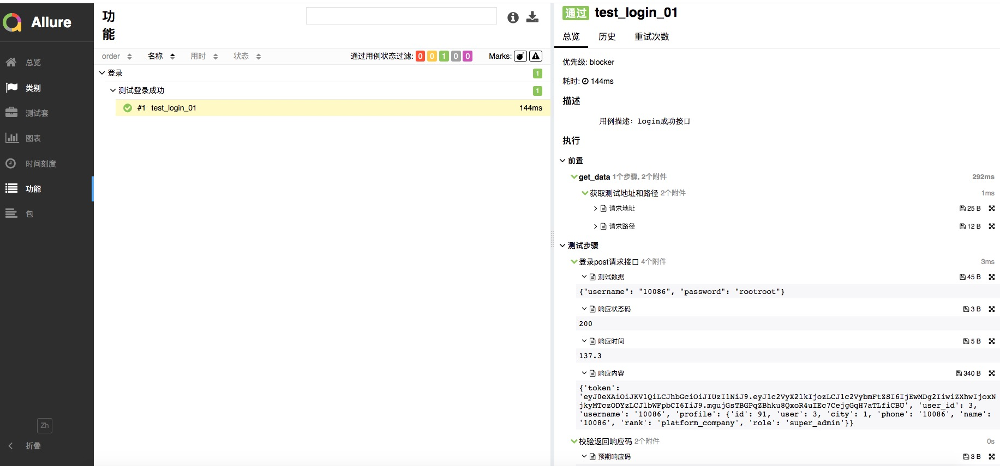
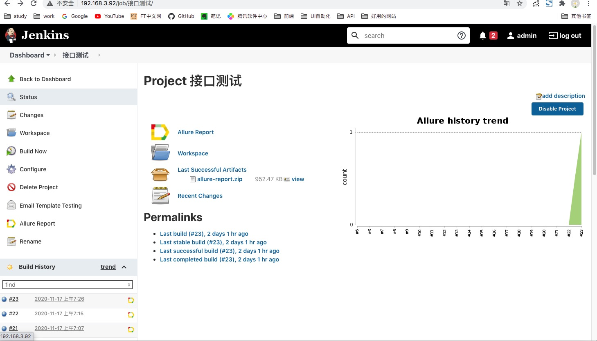

<!--
 * @Descripttion: 
 * @Author: zlj
 * @Date: 2020-04-13 14:40:09
-->
# API_Automation
基于Pytest+request+Allure的接口自动化框架

----
#### 模块类的设计
`Request.py` 封装request方法，可以支持多协议扩展（get\post\put\path\delete）

`Config.py`读取配置文件，包括：不同环境的配置，email相关配置

`Log.py` 封装记录log方法，分为：debug、info、warning、error、critical

`Email.py`封装smtplib方法，运行结果发送邮件通知

`Assert.py` 封装assert方法

`Session.py` 封装获取登录cookies方法

`run.py` 核心代码。定义并执行用例集，生成报告


## 目录结构
```
.
├── Common
│   ├── Assert.py  ————封装Assert
│   ├── Consts.py  ————定义全局变量
│   ├── DB_sql.py  ————连接数据库封装sql
│   ├── Email.py  ————封装SMTP
│   ├── Log.py   ————封装记录log方法
│   ├── Send_Request.py ————封装request
│   ├── Session.py ————创建session
│   ├── Shell.py  ————封装shell命令
│   ├── __init__.py
│   
├── Conf
│   ├── Config.py ————封装读取配置ini文件
│   ├── __init__.py
│   └── config.ini ————定义配置文件
│ 
├── Log  ————日志记录
│   ├── __init__.py
│   ├── err.log
│   └── log.log
│ 
├── Params
│   ├── Param
│   │   └── Datas.yml ————yaml数据源
│   ├── __init__.py
│   ├── params.py ————按照模块封装测试数据
│   ├── parseExcel.py  ————封装读取Excel方法
│   ├── tcData.xlsx ————excel数据源
│   ├── tools.py ————封装读取Yaml方法
│  
├── Report  ————测试报告
│   ├── html 
│   └── xml
│ 
├── TestCase
│   ├── conftest.py
│   ├── test_login.py
│   └── test_profile.py
│ 
└── run.py  ————核心代码，执行
│
├── README.md

```

##### 打开报告： allure open Report/html
  
----

集成Jenkins进行持续构建：
  